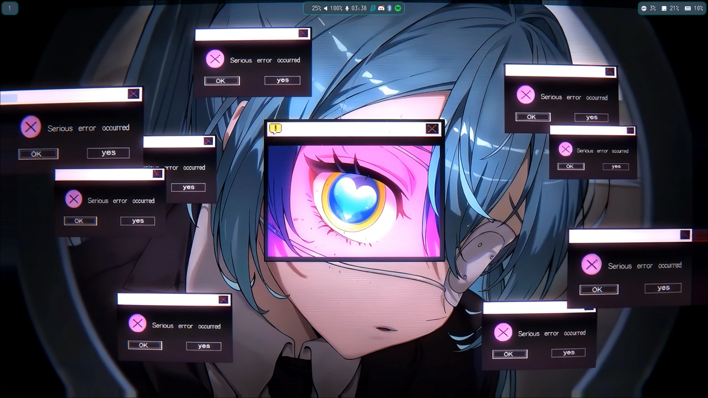
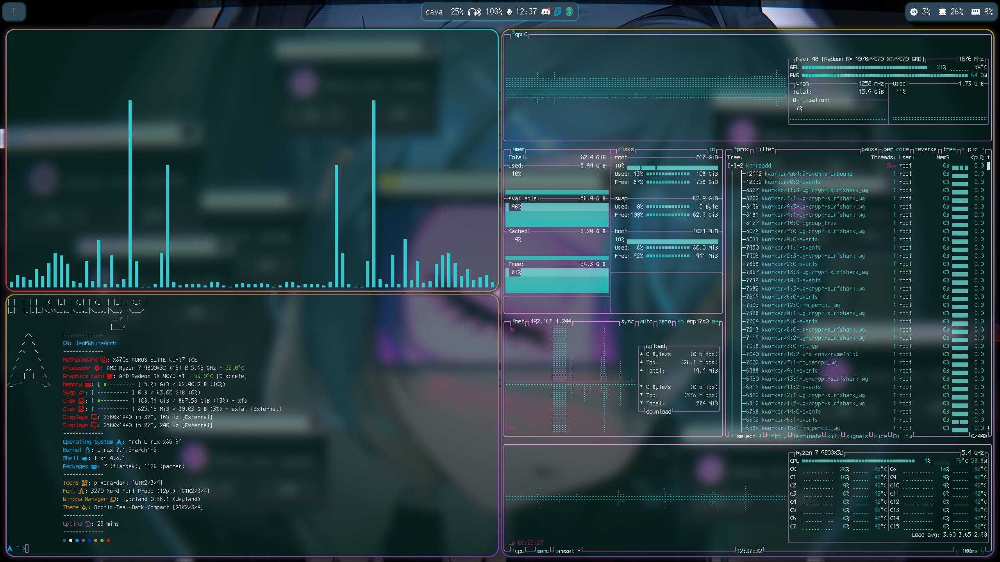
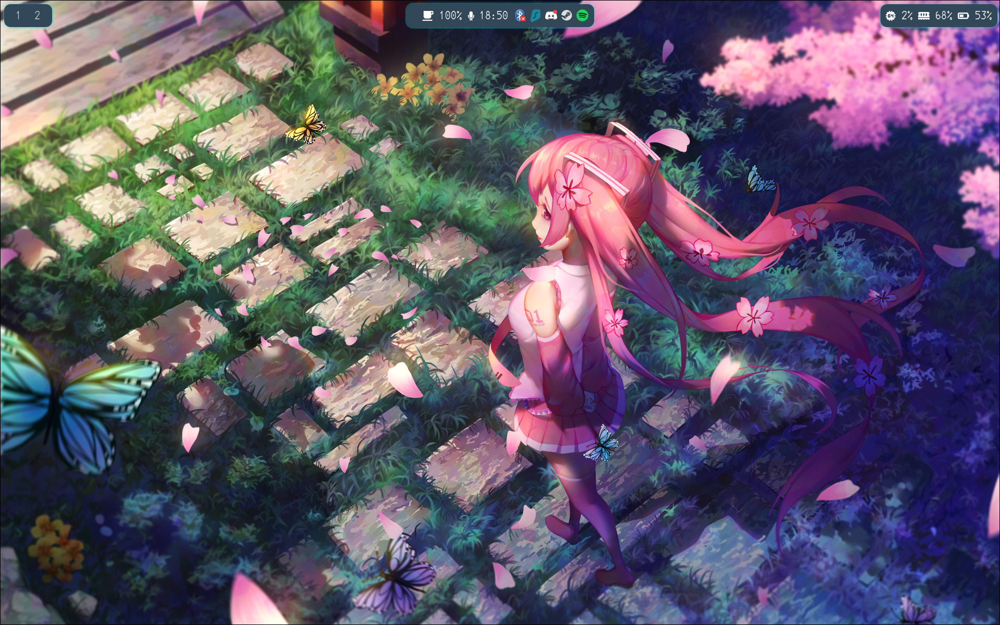
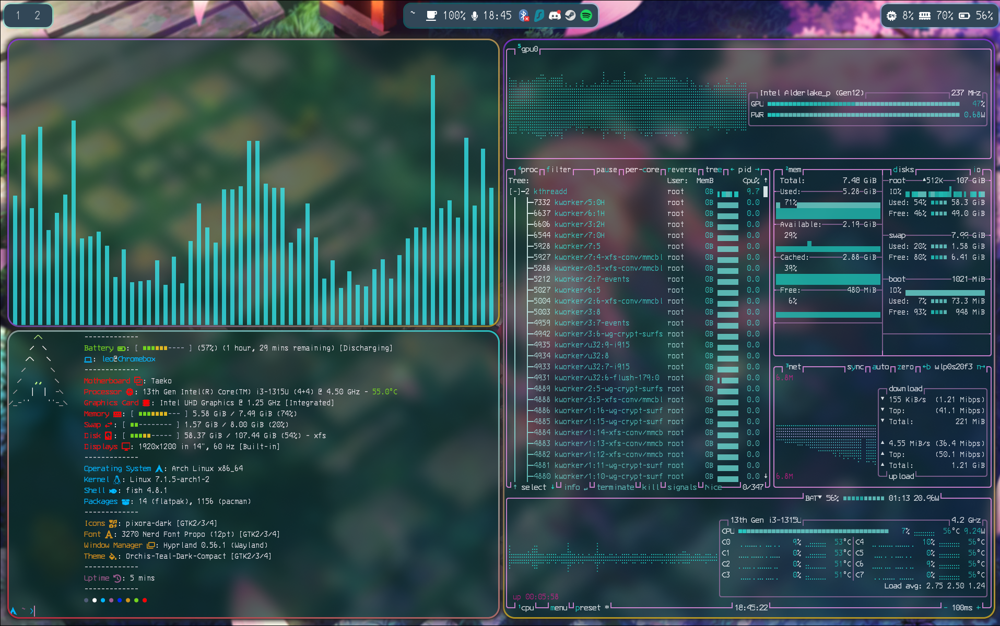

* Showcase Videos
  * Desktop: https://youtu.be/DI_1mhMy7UM
  * Laptop: https://youtu.be/Btw6sJjUXpA
* These are my extremely simple dotfiles for desktop and laptop if forking go to the final line

* Cool Screenshot Time
  * Universal
   * Notifications
   

  * Desktop
    * Blank Desktop
    

    * All customized terminal scripts 
    

 * Laptop
  * Blank Laptop
  

  * All customized terminal scripts
  

* Credits
  * All credits to dotfiles files go to me since well I made them
  * All (Credits to everything used across all configs)
   * Btop: https://github.com/aristocratos/btop
    * Mako: https://github.com/emersion/mako
    * Waybar: https://github.com/alexays/waybar
    * Emote: https://github.com/tom-james-watson/Emote
    * Cursor: https://store.kde.org/p/2355061/
    * Icons: https://github.com/tsora1603/pixora-icons
    * Color Scheme: https://store.kde.org/p/1903937
    * GTK Theme: https://store.kde.org/p/1357889
    * Hypr: https://hypr.land/
    * Pavucontrol: https://freedesktop.org/software/pulseaudio/pavucontrol/?__goaway_challenge=meta-refresh&__goaway_id=128ae0061403e266fec343f88ab37161&__goaway_referer=https%3A%2F%2Farchlinux.org%2F
    * Fastfetch: https://github.com/fastfetch-cli/fastfetch
    * Font: https://www.nerdfonts.com/
    * Shell: https://fishshell.com/
    * Screenshots: (Slurp: https://github.com/emersion/slurp) (Swappy: https://github.com/jtheoof/swappy) (Grim: https://github.com/emersion/grim)
    * UWSM: https://github.com/Vladimir-csp/uwsm
    * Terminal: https://github.com/kovidgoyal/kitty
    * Figlet: https://www.figlet.org/
    * Cmatrix: https://github.com/abishekvashok/cmatrix
    * Dolphin: https://kde.org/
    *Firefox: https://www.firefox.com/
  * Desktop
    * Wallpaper Renderer: https://github.com/GhostNaN/mpvpaper
    * Wallpaper: https://moewalls.com/anime/miku-error-vocaloid-live-wallpaper/ or https://steamcommunity.com/sharedfiles/filedetails/?id=3729448969
  * Laptop
    * power-profiles-daemon: https://gitlab.freedesktop.org/upower/power-profiles-daemon
    * Wallpaper Renderer: https://hypr.land/
    * Wallpaper: I had some trouble finding it again on the web if anyone is able to source the wallpaper please tell me so I can add it to credits

* If you do not give me any credit though and your dotfiles are a fork of mine and only have minor visual change like changing the roundness or color of something I will take action and take it down just because its under a Public license does not  mean I can not take action
